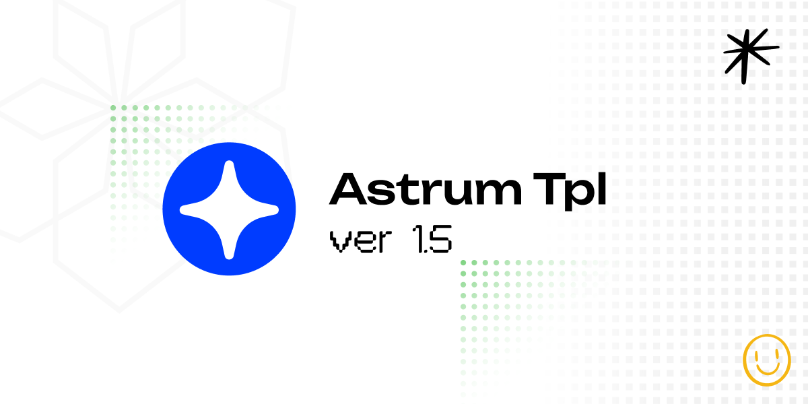

# Astrum

A modern, lightweight front-end template by Space5 for building responsive web applications.

## Overview

Astrum provides a robust foundation for web projects with carefully crafted CSS components, responsive layouts, and utility classes. It's designed to be simple, flexible, and highly customizable.


## Features

- **Responsive Grid System** - Flexible grid layouts that work across devices
- **Modern UI Components** - Buttons, forms, cards, navigation elements, and more
- **Variable-based Theming** - Easily customize colors, sizes, and spacing
- **Lightweight & Fast** - No bloat, only what you need
- **Cross-browser Compatible** - Works in all modern browsers
- **Mobile-first Design** - Looks great on any device

## Demo

Visit the online demo to see Astrum in action:

- **Live Demo**: [wblabs.github.io/astrum-demo/](https://wblabs.github.io/astrum-demo/)
- **Demo Repository**: [github.com/wblabs/astrum-demo](https://github.com/wblabs/astrum-demo)

## Getting Started

### Quick Start

1. Clone the repository:
   ```bash
   git clone https://github.com/wblabs/astrum.git
   ```

2. Include the CSS in your HTML:
   ```html
   <link href="css/normalize/normalize.css" rel="stylesheet">
   <link href="css/astrum.css" rel="stylesheet">
   ```

3. Include the JavaScript:
   ```html
   <script src="js/astrum.js"></script>
   ```

### Project Structure

```
astrum/
├── css/
│   ├── normalize/
│   │   └── normalize.css
│   ├── astrum.css
│   └── sp5notify.css
├── js/
│   └── astrum.js
├── img/
│   ├── logo.svg
│   ├── sp5sprite.svg
│   ├── sp5share.svg
│   └── sp5rte.svg
├── favicon/
│   └── ...
└── index.html
```

## CSS Structure

The CSS is organized in a logical, easy-to-understand structure:

1. **Base Settings**
    - Font imports
    - Variables
    - Base tag styling

2. **Tokens**
    - Core design tokens and utility classes

3. **Service Classes**
    - Padding utilities
    - Icon systems
    - Video responsive utilities

4. **Grid System**
    - Responsive grid layouts
    - Column configurations

5. **Buttons**
    - Default buttons
    - Button variations (outline, ghost, UI, micro)
    - Button sizes
    - Button groups

6. **Forms**
    - Input fields
    - Checkboxes and radio buttons
    - Select menus
    - Form layouts

7. **Typography**
    - Headings
    - Text utilities
    - Font styles

8. **Components**
    - Product cards
    - Breadcrumbs
    - Pagination
    - Notifications

9. **Layout**
    - Header
    - Navigation
    - Main content
    - Footer

## Customization

Astrum uses CSS variables for easy customization. You can override the default variables in your own CSS file:

```css
:root {
  --color-primary: #your-primary-color;
  --color-secondary: #your-secondary-color;
  --wf: 'Your Font', sans-serif;
  --wid: 1200px; /* max width of content */
}
```

## Figma Integration: AstrumTransitus

Enhance your workflow with the Figma plugin (Development version) for Astrum:

### AstrumTransitus

"A plugin to export styles from Figma into Astrum CSS, purified and ready to serve the Emperor"

- **Repository**: [github.com/wblabs/AstrumTransitus](https://github.com/wblabs/AstrumTransitus)

AstrumTransitus allows designers to export Figma styles directly to Astrum CSS variables, streamlining the design-to-development process. This powerful tool ensures design consistency by automatically generating CSS that matches your Figma design system.

### Key Features:
- One-click export from Figma to Astrum CSS
- Automatic conversion of Figma color styles to CSS variables
- Typography and spacing token generation
- Direct implementation into your Astrum project

## Browser Support

Astrum supports all modern browsers, including:

- Chrome (latest)
- Firefox (latest)
- Safari (latest)
- Edge (latest)

## Acknowledgments

- Created and maintained by Ed Ostrovsky
- Normalize.css by Nicolas Gallagher and Jonathan Neal
